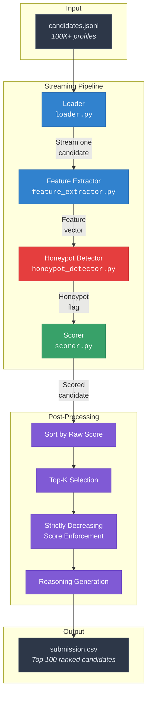
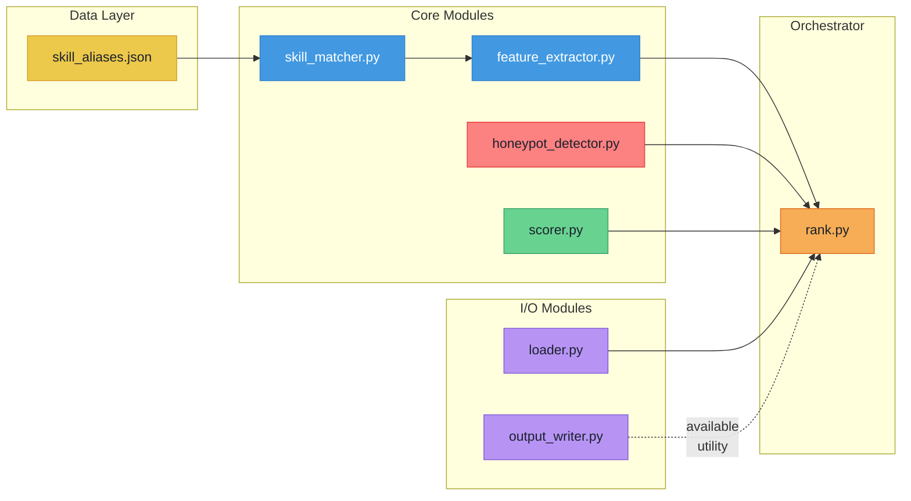
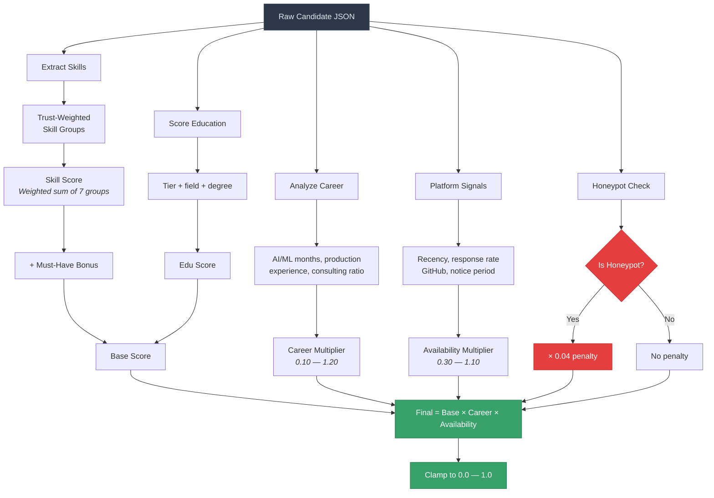
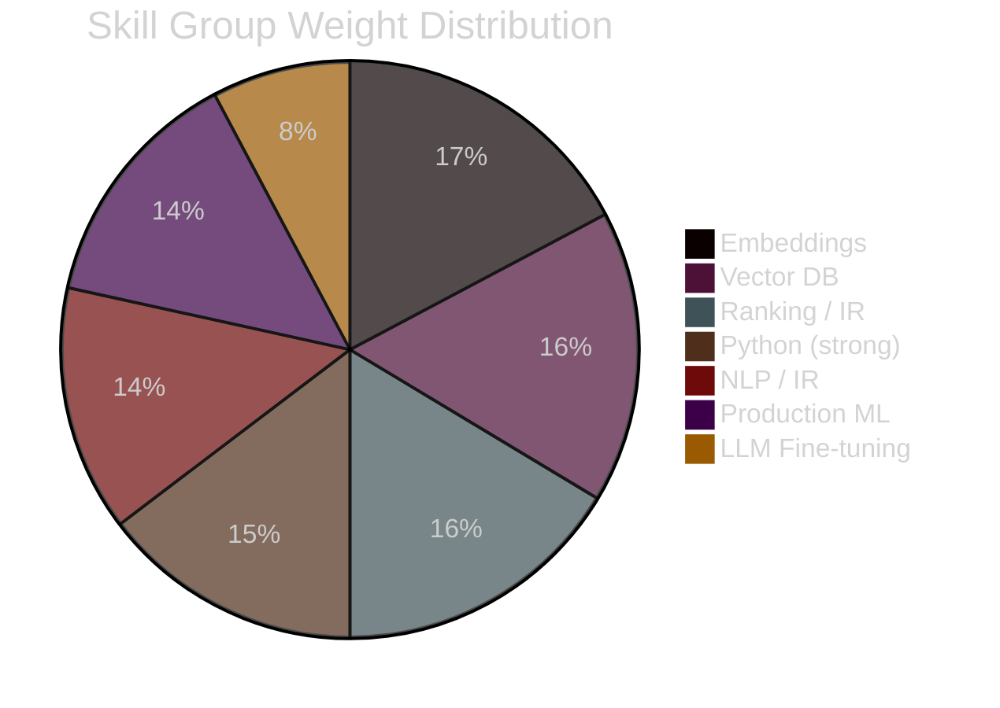
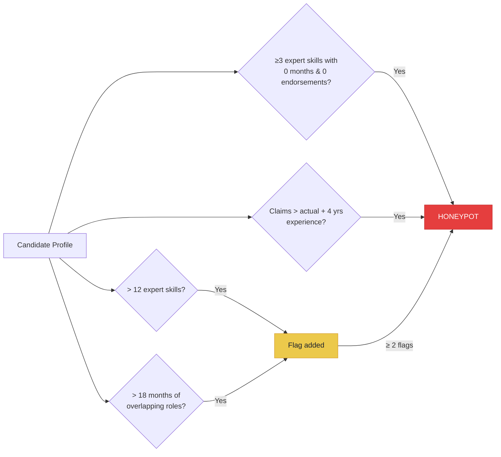
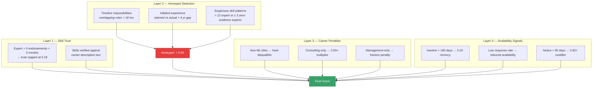

<div align="center">

# Candis — Candidate Discovery Ranker

**A CPU-only, rule-based candidate ranking engine for the [Redrob India Runs Data & AI Challenge](https://redrob.io)**

[](#prerequisites)
[](#design-philosophy)
[](#license)

*Ranks 100,000+ candidates for a Senior AI Engineer role in under 5 minutes — no GPU, no API calls, no network access.*

</div>

---

## Table of Contents

- [Overview](#overview)
- [Design Philosophy](#design-philosophy)
- [Architecture](#architecture)
- [Scoring Pipeline](#scoring-pipeline)
- [Module Breakdown](#module-breakdown)
- [Project Structure](#project-structure)
- [Getting Started](#getting-started)
- [Output Format](#output-format)
- [Safeguards & Anti-Gaming](#safeguards--anti-gaming)
- [Tech Stack](#tech-stack)

---

## Overview

**Candis** is a deterministic, rule-based candidate ranking system built for the Redrob hackathon. Given a JSONL file of 100K+ candidate profiles, it identifies and ranks the top 100 candidates best suited for a **Senior AI Engineer** role specializing in *embeddings, vector search, ranking/IR, and production ML*.

The ranker combines four key dimensions into a single score:

| Dimension | What It Measures |
|:--|:--|
| **Skill Fit** | Trust-weighted match against 7 JD-aligned skill groups |
| **Career Trajectory** | AI/ML role depth, production experience, consulting vs. product tenure |
| **Honeypot Detection** | Flags fraudulent profiles with impossible timelines or inflated skills |
| **Platform Availability** | Redrob behavioral signals — activity recency, response rate, notice period |

---

## Design Philosophy

```
Deterministic   — Same input always produces the same ranking
Fast            — Streams JSONL line-by-line; 100K candidates < 5 min on CPU
Anti-Gaming     — Multi-layered honeypot detection penalizes keyword stuffers
Zero Dependencies — No GPU, no network, no external APIs during ranking
```

---

## Architecture

### System Overview



### Module Interaction



---

## Scoring Pipeline

### How a Candidate Gets Scored



### Skill Group Weights

The ranker evaluates candidates against **7 JD-aligned skill groups**, each with a configurable weight:



Each skill group aggregates dozens of keyword aliases (defined in [`skill_aliases.json`](data/skill_aliases.json)) into a canonical group score, weighted by:

| Factor | How It Works |
|:--|:--|
| **Proficiency** | `beginner=0.25` → `expert=1.0` |
| **Endorsements** | Logarithmic bonus up to 18 endorsements |
| **Duration** | Bonus saturates at 36 months |
| **Trust Discount** | Expert + 0 endorsements + 0 months → capped at `0.18` (anti-stuffing) |

---

## Module Breakdown

### rank.py — Orchestrator

The main entry point. Streams candidates from JSONL, runs them through the scoring pipeline, sorts results, enforces strictly decreasing scores, and writes the final CSV.

### src/loader.py — Data Loader

Memory-efficient streaming reader for `.jsonl` and `.jsonl.gz` files. Uses `ujson` for fast JSON parsing with a `json` stdlib fallback.

### src/skill_matcher.py — Skill Alias Resolution

Loads [`skill_aliases.json`](data/skill_aliases.json) and maps raw skill names and free-text mentions to 7 canonical skill groups via substring matching.

### src/feature_extractor.py — Feature Engineering

The largest module. Extracts and normalizes features across four dimensions:

| Function | Purpose |
|:--|:--|
| `extract_candidate_skill_groups()` | Trust-weighted skill scoring with anti-stuffing |
| `score_career_for_role()` | Career analysis: AI/ML tenure, production depth, consulting ratio |
| `score_education()` | Education tier + field relevance + degree level |
| `score_redrob_signals()` | Platform activity, availability, and engagement metrics |
| `score_experience_fit()` | Sweet-spot scoring for 5–9 years experience |
| `extract_all_features()` | Aggregates all features into a single candidate dict |

### src/honeypot_detector.py — Fraud Detection

Identifies fake/impossible profiles using multiple heuristics:



### src/scorer.py — Scoring Engine

Combines all features into the final score using a multiplicative model:

```
Final Score = Base Score × Career Multiplier × Availability Multiplier
```

Where **Base Score** includes skill fit, must-have bonuses, experience fit, education, assessments, and certifications.

### src/output_writer.py — CSV Writer

Utility module for writing the ranked output to CSV format.

---

## Project Structure

```
candis/
├── rank.py                      # Main entry point & orchestrator
├── requirements.txt             # Dependencies (ujson only)
├── submission.csv               # Generated output
├── submission_metadata.yaml     # Challenge submission metadata
│
├── src/
│   ├── loader.py                # JSONL streaming reader
│   ├── skill_matcher.py         # Skill alias → canonical group mapping
│   ├── feature_extractor.py     # Feature engineering (skills, career, edu, platform)
│   ├── honeypot_detector.py     # Fraudulent profile detection
│   ├── scorer.py                # Multiplicative scoring engine
│   └── output_writer.py         # CSV output helper
│
├── data/
│   └── skill_aliases.json       # 7 skill groups with 90+ keyword aliases
```

---

## Getting Started

### Prerequisites

- **Python 3.10+** (tested on 3.x)
- No GPU required
- No network access required

### Installation

```bash
# Clone the repository
git clone <repo-url> && cd candis

# Install dependencies
pip install -r requirements.txt
```

> **Note:** The only external dependency is [`ujson`](https://pypi.org/project/ujson/) for faster JSON parsing. The system gracefully falls back to the standard library `json` if `ujson` is unavailable.

### Running the Ranker

```bash
# Generate the ranked submission
python rank.py \
  --candidates "./candidates.jsonl" \
  --out submission.csv
```

### Options

| Flag | Default | Description |
|:--|:--|:--|
| `--candidates` | *(required)* | Path to `candidates.jsonl` or `candidates.jsonl.gz` |
| `--out` | *(required)* | Output CSV path |
| `--top-k` | `100` | Number of top candidates to include |

---

## Output Format

The ranker produces a CSV with the following columns:

| Column | Type | Description |
|:--|:--|:--|
| `candidate_id` | string | Unique candidate identifier (e.g., `CAND_0029367`) |
| `rank` | int | Position in ranking (1 = best) |
| `score` | float | Final score, strictly decreasing, in `[0, 1]` |
| `reasoning` | string | Human-readable explanation of the ranking decision |

**Example output:**

```
candidate_id,rank,score,reasoning
CAND_0029367,1,1.000000,"Senior Data Scientist with 5.7 yrs; Python, vector search, embeddings, NLP/RAG; ~5.6 yrs AI/ML-aligned work. Strong availability and career fit signals for the JD."
CAND_0077337,2,0.999999,"Staff ML Engineer with 7.0 yrs; embeddings, LLM fine-tuning, vector search, production ML; ~7.0 yrs AI/ML-aligned work. Strong availability and career fit signals for the JD."
```

---

## Safeguards & Anti-Gaming

The ranker implements multiple layers of defense against profile manipulation:



---

## Tech Stack

| Component | Technology |
|:--|:--|
| Language | Python 3.x |
| JSON Parsing | `ujson` (with `json` fallback) |
| Compute | CPU-only, single-threaded |
| Dependencies | 1 (`ujson>=5.0.0`) |
| GPU Required | No |
| Network Required | No |
| AI Tools Used | Codex (development assistance only) |

---

<div align="center">

**Built for the Redrob India Runs Data & AI Challenge**

*Team Candis*

</div>
